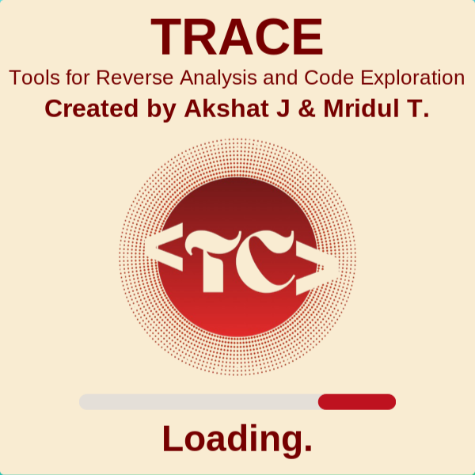
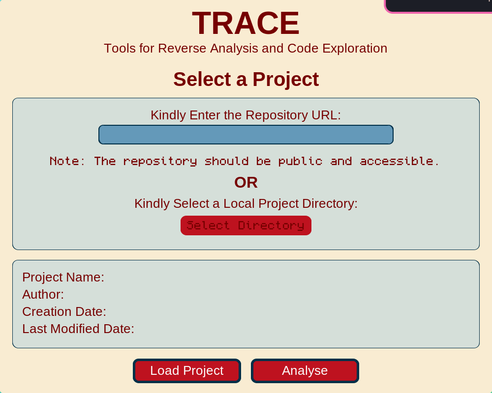
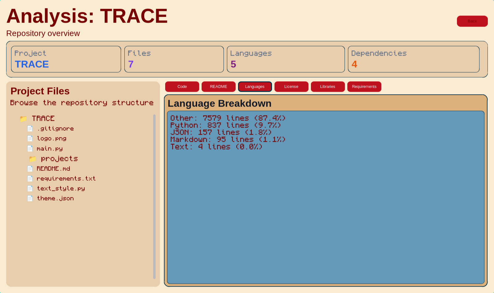

<p align="center">
  
</p>

<h1 align="center">TRACE</h1>

<p align="center">
  <strong>Toolkit for Reverse Analysis & Code Exploration</strong><br>
  Version 1.2.2
</p>

<p align="center">
  By <strong>TriCode Club Labs</strong>
</p>

---

## Overview

TRACE is a desktop application for exploring and understanding software projects.

Open a local project or clone a public GitHub repository, browse project files, inspect source code, preview images, review documentation, analyze dependencies, and understand repository structure from a modern desktop interface.

Originally built for **SFHS CODE Hack 7**, TRACE is now an active **TriCode Club Labs** project that will continue to evolve with new features and improvements.

---

## Credits

| Component | Credits |
|----------|---------|
| Python | https://python.org |
| CustomTkinter | https://customtkinter.tomschimansky.com |
| Pillow | https://python-pillow.org |
| Git | https://git-scm.com |
| GitHub REST API | https://docs.github.com/en/rest |
| Color Palette | https://coolors.co |

---

## Features

- Local & GitHub repository support
- Repository exploration
- Source code viewer
- Project documentation viewer
- Repository insights
- Image preview
- Dependency analysis
- Modern desktop interface

---

## Screenshots

### Loading Screen

<p align="center">
  
</p>

### Project Selection

<p align="center">
  
</p>

### Project Analysis

<p align="center">
  
</p>

> Screenshots will be updated as TRACE evolves.

---

## Project Team

| Name | Role |
|------|------|
| Akshat Jain | Developer |
| Mridul Thakur | Developer |

Maintained by **TriCode Club Labs**.

---

## Roadmap

| Status | Feature |
|:------:|---------|
| ⏳ | GTK4 desktop version |
| ⏳ | Official TRACE website |
| ⏳ | Cloud-based repository analysis |
| ⏳ | Cross-platform support (Linux, Windows & macOS) |
| ⏳ | Integration with the TriCode Development Suite |
| ⏳ | Rich Markdown rendering |
| ⏳ | Better repository statistics & insights |
| ⏳ | Faster analysis engine |

---

## Repository Structure

```text
TRACE/
├── assets/
│   ├── banner.png
│   ├── loading.png
│   ├── project-selection.png
│   └── analysis.png
├── projects/
├── main.py
├── text_style.py
├── theme.json
├── requirements.txt
├── LICENSE
└── README.md
```

---

## License

TRACE is distributed as **freeware**.

You may use the software for personal, educational, and non-commercial purposes.

Redistribution, modification, or commercial distribution without permission is prohibited.

The developers and TriCode Club Labs are not responsible for any misuse, damages, or data loss resulting from the use of this software.

---

<p align="center">
Made with ❤️ by <strong>TriCode Club Labs</strong>
</p>
